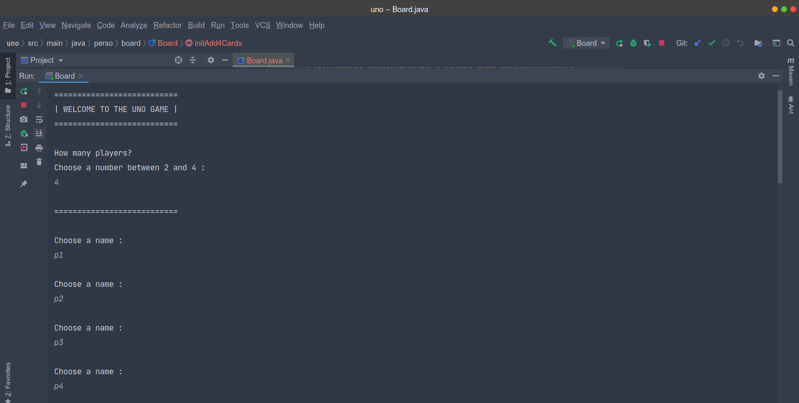
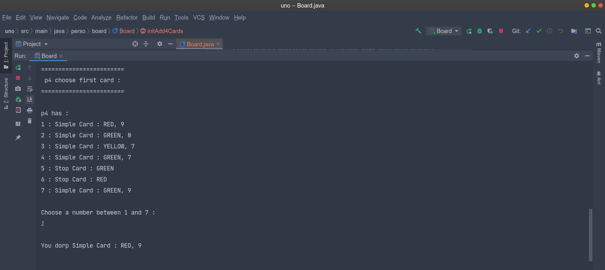
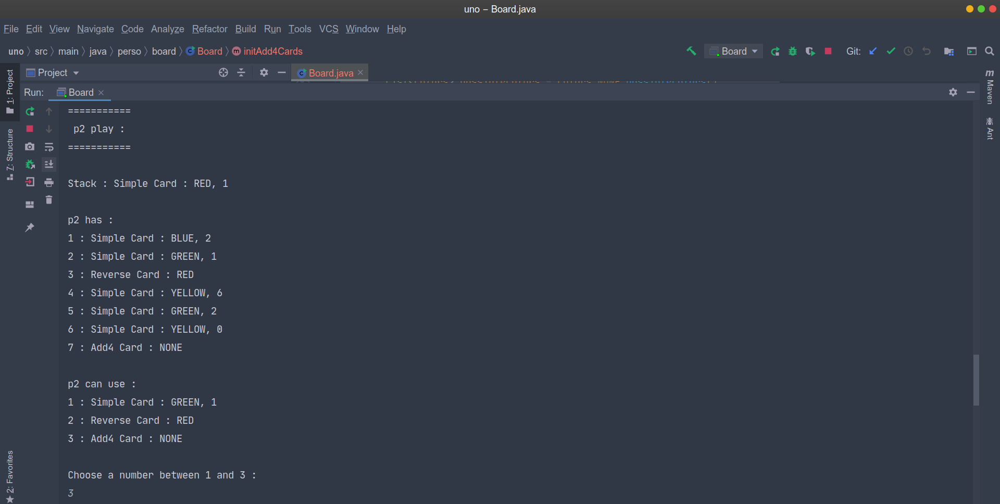
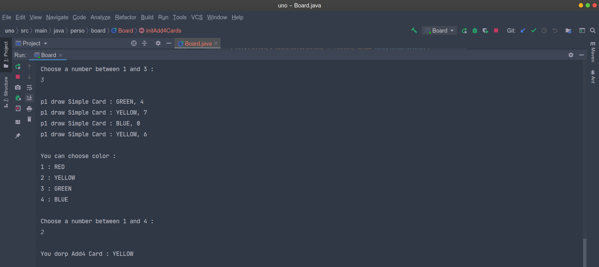

# Uno Game "

This project is a remake of the Uno game. 

I did it in 2020, during my 3rd year of university license. This is a personnal project, and is developed in Java. This project is finished.

## Rules
There are 2, 3 or 4 players, the first player who no longer has a card wins.
You can put card if it the same color or same number of the card in the top of the stack. While yo don't can play, you draw one card. 

There are manys cards :

* add 2 : draw 2 card.
* add 4 : draw 4 cards and change the color of this card. 
* reverse : change the direction of the game.
* joker : change the color of this card.
* stop : can't play.
* simple.

## To begin
Do the command :  `$ git clone https://github.com/debroucker/uno.git` to recover this repository.

## Install
You can install `InteliJ IDE` (you don't have to, but it's more simple to launch the game with it).

## Start-up
If you have InteliJ IDE : 

* open this directory with InteliJ IDE.
* build the project.
* Run 'Board' (src > main > java > perso > board).

Else, do the commands :

* `$ javac -classpath ./src/main/java src/main/java/perso/*/*.java -d out
`
* `$ java -classpath out perso.board.Board `

and enjoy.

## Made with
InteliJ IDE

## Authors
DEBROUCKER Tommy
